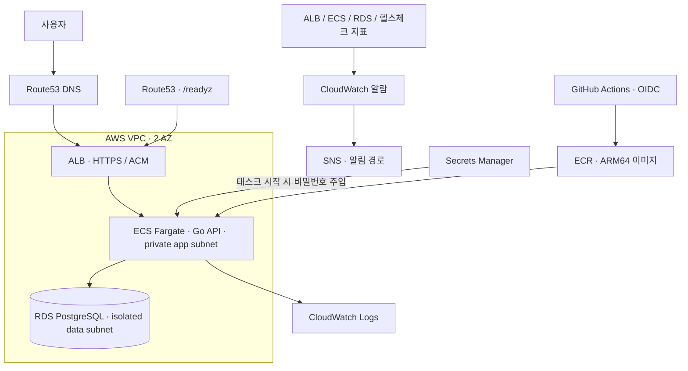
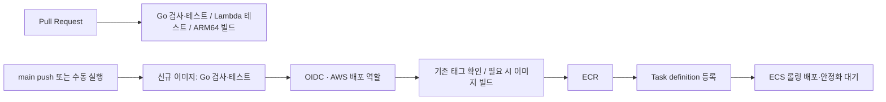

# linkpulse · Backend / AWS Operations

**Go URL 단축·클릭 집계 서비스를 만들고, AWS 배포·모니터링·장애 대응까지 연결한 개인 프로젝트입니다.**

[아키텍처](docs/architecture.md) · [배포 흐름](docs/deployment.md) · [운영 사례](docs/operations-case-study.md) · [문서 모음](docs/README.md)

## 프로젝트 한눈에 보기

긴 URL을 짧은 코드로 발급하고, 302 리다이렉트와 클릭 수 조회를 제공합니다. 작은 서비스에서도 기능 구현 이후의 배포, 의존성 장애 탐지, 복구 절차까지 다루는 것이 목표입니다.

| 항목 | 현재 코드와 문서에서 확인되는 내용 |
| --- | --- |
| Backend | Go `net/http`, PostgreSQL(`pgx`), URL 검증·코드 충돌 재시도·요청 제한 |
| Cloud / IaC | AWS ECS Fargate, ALB/ACM, RDS, ECR, Secrets Manager, Terraform |
| CI/CD | GitHub Actions, OIDC 인증, ARM64 크로스빌드, ECS 롤링 배포 |
| Monitoring | CloudWatch Logs·알람, Route53 `/readyz` 헬스체크, SNS 알림 |
| Operations | 알람 대응·비밀번호 회전 복구 런북, 장애 회고, 백업 복원 검증 설계 |

Redis/ElastiCache 및 referrer·시간대별 분석은 현재 확인한 코드에 포함되지 않습니다. 기존 README에 언급했던 EKS·k3s 확장은 향후 방향이며 완료 경험에 포함하지 않습니다. 라이브 가동 상태와 후속 자동 복구 검증은 아래 기록의 확인 범위와 구분합니다.

## 아키텍처



비용을 고려해 NAT Gateway는 1개, RDS는 Single-AZ로 선언되어 있습니다. 두 AZ에 서브넷이 있다고 전체 시스템이 완전한 고가용성을 갖추는 것은 아닙니다. [설계와 제약 자세히 보기](docs/architecture.md)

## 해결한 문제

| 문제 | 대응 | 근거 |
| --- | --- | --- |
| DB가 실패해도 `/healthz`는 정상 | 프로세스 생존과 DB 준비 상태를 분리하고 외부 점검을 `/readyz`로 변경 | [ADR 0004](docs/adr/0004-notraffic-canary.md) |
| 무트래픽이면 요청 기반 장애 신호가 부족 | Route53 외부 점검과 별도 `HealthCheckStatus` 알람 | [canary 구성](infra/prod/synthetic-canary.tf) |
| ARM 러너 배정 실패로 배포 중단 | x86 GA 러너에서 ARM64 크로스빌드 | [배포 장애 회고](docs/postmortems/2026-07-09-deploy-runner-acquisition.md) |
| Terraform이 앱 배포의 task definition을 되돌릴 수 있음 | 인프라와 이미지 배포의 관리 경계 분리 | [ADR 0001](docs/adr/0001-cicd-terraform-ci-boundary.md) |
| 클릭 집계 실패가 리다이렉트를 막을 수 있음 | 집계 오류를 기록하되 조회된 URL 리다이렉트는 계속 처리 | [서비스 코드](app/internal/links/service.go) |

## 운영 / 장애 대응

대표 사례는 **RDS 비밀번호 회전 이후 기존 프로세스가 이전 비밀번호를 유지한 장애**입니다. 2026-09-06 회고에는 전체 장애 **13시간 10분**, 수동 재배포 시작 이후 복구 **약 5분**이 기록되어 있습니다. 이 둘은 다른 지표입니다. 빠른 탐지나 알림 도달만으로 실제 복구가 보장되지 않았다는 점을 후속 설계에 반영합니다.

- [운영 사례 요약](docs/operations-case-study.md): 원인 → 탐지 → 복구 → 남은 과제
- [회고 원문(초안)](docs/postmortems/2026-09-06-rds-rotation-outage.md)
- [비밀번호 회전 복구 런북](docs/runbooks/secret-rotation-bridge.md)
- [알람 대응 런북](docs/runbooks/alarm-response.md)

후속 EventBridge → Lambda → ECS 자동 재배포 **코드와 테스트는 존재**합니다. 다만 이 README는 라이브 적용·자동 복구 시간 실측 완료를 주장하지 않습니다. 앱 내부 자격증명 갱신과 백업 복원 검증 역시 [계획·설계 문서](docs/README.md)를 통해 상태를 구분합니다.

## CI/CD



기존 ECR 태그를 지정하면 새 코드 빌드 없이 롤백할 수 있습니다. 배포는 직렬화하고 ECS circuit breaker로 실패 시 자동 롤백하도록 선언했습니다. Terraform apply는 사람이 별도로 수행합니다. [워크플로별 검증 범위와 롤백 제약](docs/deployment.md)

## 모니터링

애플리케이션 로그와 ALB/ECS/RDS 지표는 CloudWatch에서 다룹니다. 외부 Route53 헬스체크는 DB 상태가 반영된 `/readyz`를 점검하고 별도 알람을 사용합니다. canary 지표·알람은 us-east-1, 주 서비스는 ap-northeast-2 구성이므로 알림 경로도 리전별로 나뉩니다.

관측 시에는 **프로세스 생존(`/healthz`) → DB 준비 상태(`/readyz`) → 실제 URL 생성·리다이렉트**를 구분합니다. 현재 알람의 임계값·한계와 대응 절차는 [탐지 ADR](docs/adr/0004-notraffic-canary.md)와 [알람 런북](docs/runbooks/alarm-response.md)을 따릅니다.

## 로컬 실행

전체 스택(app + Postgres)을 docker-compose로 띄웁니다.

```bash
docker compose up --build
```

```bash
# 단축 생성 → {"code":"...","short_url":"http://localhost:8080/...", ...}
curl -X POST localhost:8080/api/links -d '{"url":"https://example.com"}'
# 리다이렉트 (위 응답의 code 사용)
curl -i localhost:8080/<code>
```

- 데이터는 Postgres에 저장되며 `pgdata` 볼륨으로 재시작 후에도 유지됩니다.
- 종료: `docker compose down` (데이터까지 지우려면 `docker compose down -v`).
- 호스트 8080이 이미 쓰이면: `APP_HOST_PORT=8088 docker compose up --build` (단축 URL도 그 포트로 맞춰집니다).

DB 없이 앱만 빠르게 띄우려면(인메모리, 재시작 시 데이터 소실):

```bash
cd app && go run ./cmd/server
```


## 저장소 구조

```text
app/                Go API · 테스트 · Dockerfile
infra/bootstrap/    Terraform state용 S3
infra/prod/         AWS 인프라 · 자동 재배포 Lambda
.github/workflows/  PR 검증 · 앱 배포
load/               k6 · 장애 주입 관련 자료
docs/               소개 · ADR · 런북 · 회고 · 개선 계획
```

## 인프라 배포와 상세 문서

- [인프라 초기 구성 안내](infra/README.md): Terraform 1.10+ 및 bootstrap/prod 순서
- [배포 흐름과 책임 경계](docs/deployment.md)
- [아키텍처와 가용성 제약](docs/architecture.md)
- [운영·장애 대응 사례](docs/operations-case-study.md)
- [전체 문서 탐색](docs/README.md)

이번 문서 개편은 소스·인프라·기존 회고를 보존하며, README의 이전 내용은 Git 이력에 남아 있습니다.

## 라이선스

MIT 적용 예정. 현재 저장소에는 LICENSE 파일이 없으므로 정식 라이선스 부여가 완료된 것으로 해석하지 않습니다.
